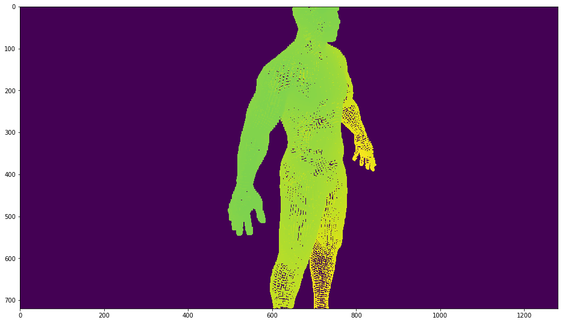
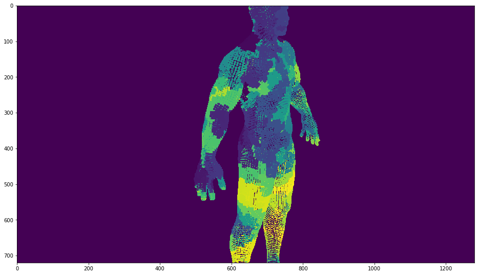

```python
import torch
import pcpr
import numpy as np
import matplotlib.pyplot as plt
```

## Prepare test parameters 


```python
# Load point cloud
vs = np.loadtxt('vertices.txt')
in_points = torch.Tensor(vs).cuda()

# Set camera parameters
K =torch.Tensor( [[1923.6, 0 ,640],[0, 1923.6, 360],[0, 0 ,1]]).cuda()
T = torch.Tensor([0.738746 ,-0.338934 ,-0.582562 ,0.619214 ,0.000001 ,0.785223 ,
                  -0.266138, -0.940810 ,0.209873 ,-32.617535 ,26.210785 ,23.938950]).cuda()

# Allocate output buffers
out_depth = torch.zeros(720,1280).cuda()
out_index = torch.zeros(720,1280, dtype = torch.int32).cuda()
```

## Invoke PCP Render


```python
out_depth, out_index = pcpr.forward(in_points, K, T, out_depth, out_index, 40,50,2.5 )
```

## Visualization


```python

plt.figure(figsize=(16, 16))
plt.imshow(out_depth.cpu().numpy())
plt.figure(figsize=(16, 16))
plt.imshow(out_index.cpu().numpy())
```








